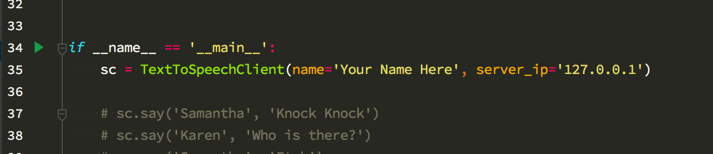

# SoundMaker

Sound Maker is a simple application which contains both client and
server code that will enable remote systems to cause noise to be made on
the server system via a network connection.

The goal in of the application is to get brand new students excited
about the possibilities presented by programming. I hope to accomplish
this by allowing them to get a remote system to respond audibly to the
commands they program. Within minutes of getting python 3 installed on
their system.

The code is in no way intended to be any sort of production ready code.
It was built for and intended to be run in a "controlled" classroom type
environment.

#### Text To Speech

There is text-to-speech code that has the server system "vocalize" the
text contained within the client code. The client programmer can specify
both the voice to be used and the text to be vocalized.

Voices available may be dependent upon the system on which the server is
running.

This is the current list available on my Mac.

Alex, Alice, Alva, Amelie, Anna, Carmit, Damayanti, Daniel, Diego,
Ellen, Fiona, Fred, Ioana, Joana, Jorge, Juan, Kanya, Karen, Kyoko,
Laura, Lekha, Luca, Luciana, Maged, Mariska, Mei-Jia, Melina, Milena,
Moira, Monica, Nora, Paulina, Samantha, Sara, Satu, Sin-ji, Tessa,
Thomas, Ting-Ting, Veena, Victoria, Xander, Yelda, Yuna, Yuri, Zosia,
Zuzana

### Running client.py file

The client.py file contains a program built to communicate with a remote
computer that is running the server.

To get things working properly you will need to open the file in some
sort of text editor, make a few small changes at the bottom of the file,
and then save it. The changes needed are...

* put your name in the parenthesis following the name=
* put the destination server's ip in the appropriate place in a similar
  manner

Once those changes are saved go ahead and run the file and see what
happens.

Open a command prompt (terminal) and type the command

python3 /path/to/your/file/client.py

Once you have ran the file the first time there are some additional lines
below the one you just changed. Experiment with removing the #
characters on those lines. Then save and run the file again to see what
happens. Once you have done that you can experiment as you like just
remember to keep things "clean".

